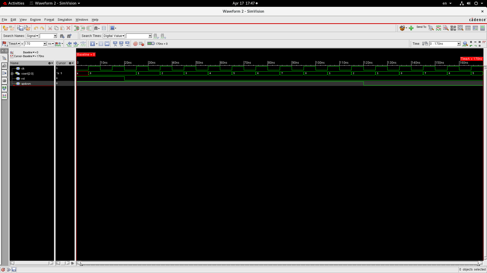
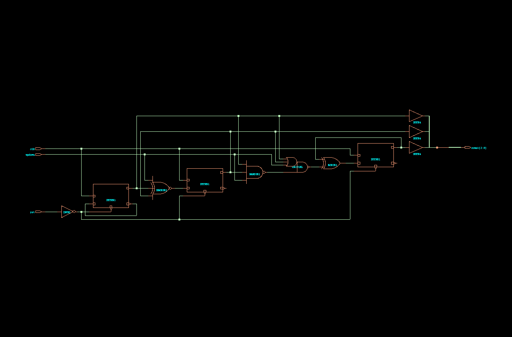
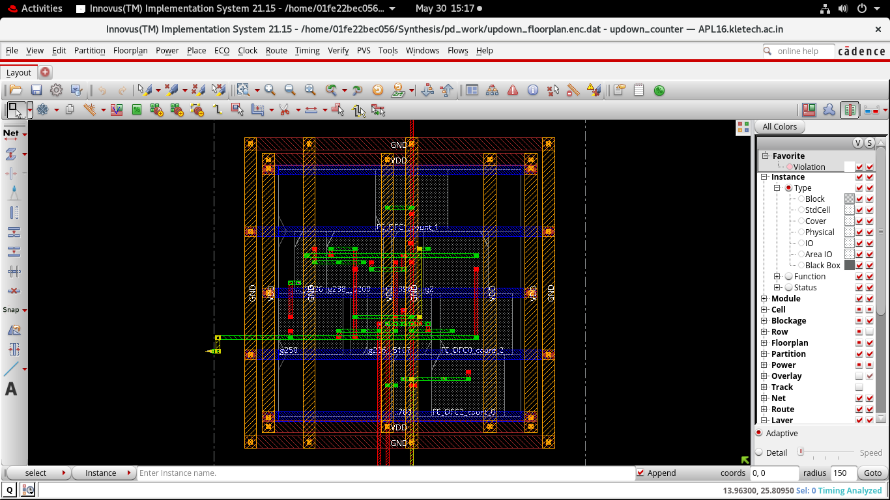

# 🔁 RTL to GDSII Flow of a 3-bit Up-Down Counter (Using Cadence Flow)
## 📘 Project Overview

This repository demonstrates the complete RTL-to-GDSII flow of a 3-bit Up/Down Counter using Cadence tools at the 45nm technology node.


---

## 📌 Project Overview

This project implements a fully synchronous 3-bit Up-Down Counter, taking it through:

- RTL design and simulation in **Verilog**
- Functional verification using **Cadence Xcelium**
- Synthesis using **Genus**
- STA using **Tempus**
- Floorplanning, placement, CTS, routing using **Innovus**

---

## 🔐 Functional Specs

The Up-Down Counter:
- Counts from 0 to 7 or 7 to 0
- Controlled by an `up_down` signal
- Synchronous reset

### ✅ I/O Signals

| Signal    | Direction | Description                   |
|-----------|-----------|-------------------------------|
| `clk`     | Input     | Clock signal                  |
| `reset`   | Input     | Active-high synchronous reset |
| `up_down` | Input     | 1 = Count Up, 0 = Count Down  |
| `count`   | Output    | 3-bit output count            |

---

## 🧪 Simulation using Xcelium

Simulate the RTL and testbench using the following steps:

```bash
xrun -f sim/compile_xcelium.f -access +rwc
```



## 🔧 Synthesis using Genus

Run the synthesis with:

```bash
genus -files synthesis/genus.tcl
```



### 📤 Outputs:
- Synthesized netlist
- Timing report
- Area report
- Power report
## 🏗️ Physical Design using Innovus

The physical design step translates the synthesized netlist into an actual physical layout. This process is done using **Cadence Innovus**, and involves multiple stages:

### 🧱 Key Stages:
1. **Floorplanning** – Define chip dimensions, core/utilization area, and pin placement.
2. **Placement** – Position standard cells based on netlist and timing constraints.
3. **Clock Tree Synthesis (CTS)** – Balance the clock network to reduce skew and meet timing.
4. **Routing** – Connect all placed cells with metal layers as per DRC rules.
5. **GDSII Export** – Generate the final GDSII file, which is sent to fabrication.

## 🖼️ After Clock Tree Synthesis

This image shows the layout after CTS performed in Cadence Innovus.



